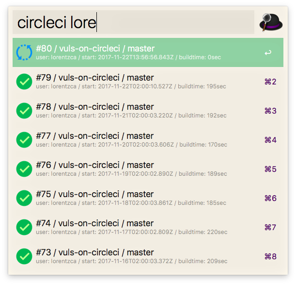
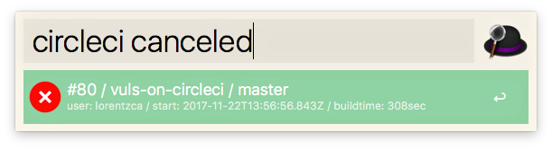

# Alfred CircleCI Workflow

Show CircleCI Build Status.





## Install

Download and double-click.

## Usage

Register CircleCI Token.

- save to `token` file in workflow's data folder

```
circleci token <XXXX>
```

Search and show hosts status.

- filterable word is repository or branch or build status or username

```
circleci <filter>
```
